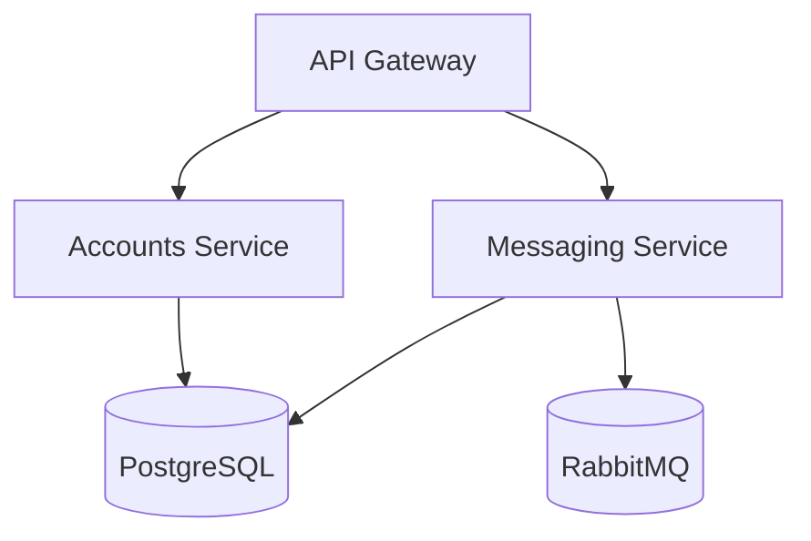
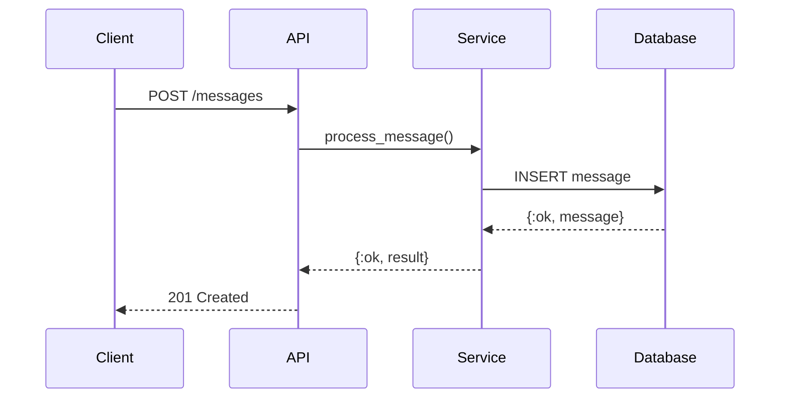
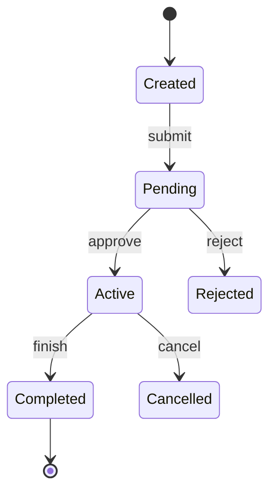
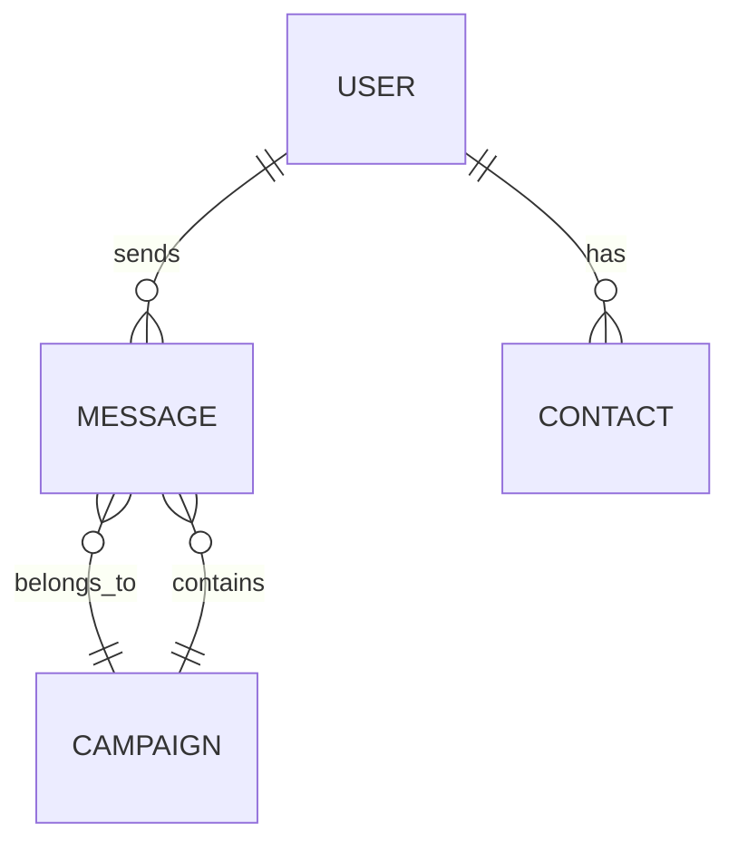

---
allowed-tools:
  - Read
  - Glob
  - Grep
  - Bash
  - Write
  - Agent
  - AskUserQuestion
effort: medium
---

# Visualize — Architecture & System Diagrams

Generates visual representations of codebase architecture, data flows, module relationships, or complex systems. Outputs ASCII diagrams for terminal, Mermaid for markdown/docs, and self-contained HTML presentations for rich visuals.

## Input

$ARGUMENTS — One of:
- A directory or module path: `lib/accounts/` — diagrams the module structure
- A concept: `"message pipeline"` — maps the data flow
- A format flag: `--ascii`, `--mermaid`, `--html` (default: all three)
- A scope flag: `--depth 2` — controls how many levels deep to trace (default: 3)
- Combined: `lib/messaging/ --html "show the pub/sub flow"`

## Instructions

### Phase 1: Map the System

**Determine what to diagram:**

- **Directory path** — map module structure, dependencies, and data flow within that area
- **Concept/question** — search the codebase for the relevant components and trace their connections
- **No arguments** — map the top-level project architecture

**Gather structural information:**

```bash
# Directory structure
find <path> -type f -name "*.ex" -o -name "*.py" -o -name "*.ts" | head -100

# Module dependencies (Elixir)
grep -r "alias\|import\|use " <path> --include="*.ex" | head -50

# Imports (Python)
grep -r "^from\|^import" <path> --include="*.py" | head -50

# Function calls between modules
grep -rn "def \|defp \|def " <path> --include="*.ex" | head -50
```

**Use subagents for large codebases** — launch parallel Agent workers to explore different subsystems, then combine their structural maps.

**Build a dependency graph:**
- Which modules depend on which?
- What are the entry points?
- Where does data flow in and out?
- What are the external dependencies (databases, queues, APIs)?
- What are the layers/boundaries?

### Phase 2: Choose Diagram Types

Select the right diagram type based on what's being visualized:

| What | Diagram Type | Best Format |
|------|-------------|-------------|
| Module structure | Box diagram / tree | ASCII, Mermaid |
| Request flow | Sequence diagram | Mermaid, ASCII |
| Data pipeline | Flow chart | Mermaid, HTML |
| State machine | State diagram | Mermaid |
| Dependencies | Dependency graph | Mermaid, HTML |
| Database schema | ER diagram | Mermaid |
| System overview | Architecture diagram | HTML, ASCII |
| Supervision tree | Tree diagram | ASCII, Mermaid |

Generate multiple diagram types if the system benefits from different perspectives.

### Phase 3: Generate ASCII Diagrams

ASCII diagrams are always generated (unless `--html` or `--mermaid` only is specified):

**Box diagrams for architecture:**
```
┌─────────────────────────────────────────────────┐
│                    API Gateway                    │
└──────────┬────────────────────┬──────────────────┘
           │                    │
    ┌──────▼──────┐     ┌──────▼──────┐
    │  Accounts   │     │  Messaging   │
    │  Service    │     │  Service     │
    └──────┬──────┘     └──────┬──────┘
           │                    │
    ┌──────▼──────┐     ┌──────▼──────┐
    │  PostgreSQL  │     │  RabbitMQ   │
    └─────────────┘     └─────────────┘
```

**Flow diagrams for data pipelines:**
```
Input ──→ Validate ──→ Transform ──→ Enrich ──→ Store
              │                         │
              ▼                         ▼
          [Error Queue]           [Audit Log]
```

**Tree diagrams for module hierarchy:**
```
lib/
├── accounts/
│   ├── user.ex          # Core user schema
│   ├── auth.ex          # Authentication logic
│   └── permissions.ex   # RBAC system
├── messaging/
│   ├── pipeline.ex      # Message processing
│   ├── router.ex        # Topic routing
│   └── delivery.ex      # Delivery guarantees
└── shared/
    ├── repo.ex          # Database interface
    └── telemetry.ex     # Observability
```

### Phase 4: Generate Mermaid Diagrams

Output Mermaid syntax in fenced code blocks:

**Architecture diagram:**
````markdown

````

**Sequence diagram:**
````markdown

````

**State diagram:**
````markdown

````

**ER diagram:**
````markdown

````

### Phase 5: Generate HTML Presentation (if `--html` or default)

Create a self-contained HTML file with interactive diagrams:

Write the HTML file to `/tmp/visualize_<name>.html`:

```html
<!DOCTYPE html>
<html>
<head>
  <title>[System Name] — Architecture</title>
  <script src="https://cdn.jsdelivr.net/npm/mermaid/dist/mermaid.min.js"></script>
  <style>
    body { font-family: -apple-system, sans-serif; max-width: 1400px; margin: 0 auto; padding: 20px; background: #fafafa; }
    .diagram-section { background: white; border-radius: 8px; padding: 24px; margin: 16px 0; box-shadow: 0 1px 3px rgba(0,0,0,0.1); }
    .diagram-section h2 { margin-top: 0; color: #333; }
    .legend { display: flex; gap: 16px; flex-wrap: wrap; margin: 12px 0; }
    .legend-item { display: flex; align-items: center; gap: 6px; font-size: 0.9em; }
    .legend-color { width: 12px; height: 12px; border-radius: 2px; }
    .note { background: #fff3cd; border-left: 4px solid #ffc107; padding: 12px 16px; margin: 12px 0; font-size: 0.9em; }
    .mermaid { text-align: center; }
    pre { background: #1e1e1e; color: #d4d4d4; padding: 16px; border-radius: 6px; overflow-x: auto; }
    table { border-collapse: collapse; width: 100%; margin: 12px 0; }
    th, td { border: 1px solid #ddd; padding: 8px 12px; text-align: left; }
    th { background: #f5f5f5; font-weight: 600; }
  </style>
</head>
<body>
  <h1>[System Name] — Architecture Overview</h1>
  <p>[Brief description of what this diagram shows]</p>

  <div class="diagram-section">
    <h2>System Architecture</h2>
    <div class="mermaid">
      [Mermaid diagram code]
    </div>
    <div class="note">[Key insight about the architecture]</div>
  </div>

  <div class="diagram-section">
    <h2>Data Flow</h2>
    <div class="mermaid">
      [Sequence or flow diagram]
    </div>
  </div>

  <div class="diagram-section">
    <h2>Module Overview</h2>
    <table>
      <tr><th>Module</th><th>Responsibility</th><th>Dependencies</th></tr>
      [rows]
    </table>
  </div>

  <script>mermaid.initialize({startOnLoad: true, theme: 'default'});</script>
</body>
</html>
```

Open the file:
```bash
open /tmp/visualize_<name>.html
```

### Phase 6: Present Results

Show all generated diagrams inline (ASCII and Mermaid appear in the terminal).

If HTML was generated, note the file path and open it.

Offer follow-ups:
- "Want me to diagram a specific area in more detail?"
- "Should I add this diagram to your project docs?"
- "Want an `/agentic-coding-workflow:explain` walkthrough of any component shown here?"

## Error Handling

**If the codebase is very large:**
Start with top-level architecture only. Offer to drill into specific subsystems on request.

**If the target is a single file:**
Show the file's relationships — what calls it, what it calls, what data it touches.

**If the structure is unclear:**
Use AskUserQuestion: "This area has complex dependencies. Want me to focus on [option A: data flow] or [option B: module hierarchy]?"

## Important Constraints

- **Accuracy over aesthetics** — every box and arrow must correspond to real code. Don't invent connections.
- **Label everything** — unnamed boxes and arrows are useless. Include module names, function names, data types.
- **Show boundaries** — make it clear where one system/layer ends and another begins
- **Keep it readable** — if a diagram needs more than ~20 nodes, split it into sub-diagrams
- **Include a legend** — if using colors or special symbols, explain them
- **Ground in code** — reference actual file paths and function names so the reader can find the code

## Example Usage

```
/agentic-coding-workflow:visualize
```
Generates a top-level architecture diagram of the entire project.

```
/agentic-coding-workflow:visualize lib/messaging/
```
Maps the messaging module — structure, data flow, and dependencies.

```
/agentic-coding-workflow:visualize "how do messages flow from API to delivery?"
```
Traces and diagrams the complete message lifecycle.

```
/agentic-coding-workflow:visualize lib/accounts/ --mermaid
```
Generates Mermaid-only diagrams for the accounts module (good for pasting into docs).

```
/agentic-coding-workflow:visualize --html "full system architecture"
```
Creates an interactive HTML presentation of the system architecture.
